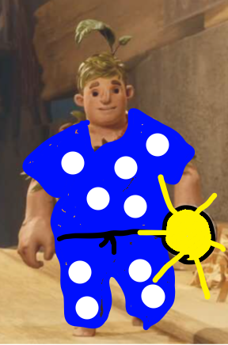
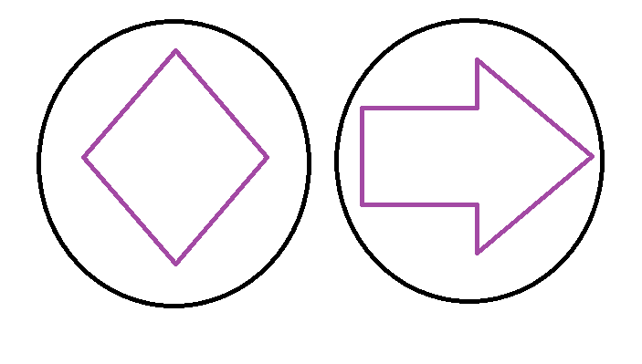
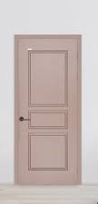

프로젝트 명 : 

목차
1. [게임명](#게임명)
2. [관련 이미지와 동영상](#관련-이미지와-동영상)
3. [대표 이미지](#대표-이미지)
4. [게임 구성요소](#게임-구성요소)
5. [게임 시스템 디자인](#게임-시스템-디자인)
6. [요구사항 (6주차)](#요구사항6주차)
7. [요구사항 (1년차)](#요구사항1년차)
8. [키보드이벤트 흐름도](#키보드이벤트-흐름도)
9. [개발 작업[(#개발-작업)

# [게임명]
## Shadow Puzzle
 

# [컨셉]
## 메인컨셉
- 그림자
- 빛으로 물체를 쏘아 그림자를 만들어 퍼즐을 풀어나감

### 서브 컨셉 1 : 
- 그래픽
- 배경은 어둡게 표현하고 플레이어는 최소한의 빛을 가지고 퍼즐을 풀러 다님.

- 플레이어는 라이터 같은 최소한의 광원을 가지고
- 각 퍼즐구간마다 랜턴을 두어 그림자를 만들게 할 생각.

### 서브 컨셉 2 : 
- 방탈출
- 플레이어는 처음에 어두운 방에서 시작하여 밖으로 탈출하기 위해
- 방을 하나하나 열면서 나아감.

플레이어는 여러방을 지나 최종적으론 밖으로 탈출하는 것이 목표.

### 서브 컨셉 3 : 
- 조작
- 캐릭터의 뒤통수를 바라보는 형태의 게임 뷰.
- 보편적인 fps의 조작법과 유사함.

### 서브 컨셉 4 : 
- 스토리

- 주인공이 스테이지를 나아가는 이유

 

# [관련 이미지와 동영상]
- 관련 이미지  

- 동영상
[youtube동영상링크](https://www.youtube.com/watch?time_continue=29&v=L1nF4XfnJMs&feature=emb_title)

 

# [대표 이미지]

 

# [컨셉과 대표이미지 기반 작품 묘사]

 

# [Shadow Puzzle 구성 요소]

## 1. 메커니즘
[도전 과제]
1. 타겟의 모양에 맞는 오브젝트를 준비
2. 타겟에 맞게 그림자를 만들어서 퍼즐을 완성

[재미 요소]
1. 구 형태의 오브젝트가 없어도 원통형의 오브젝트를 그림자로 비추면 구가 되듯 전혀 다른 모양으로 타겟의 모양을 완성하여 퍼즐을 푸는 재미

## 2. 이야기
[만들게 된 배경]
- 여러 퍼즐게임을 해보며 퍼즐게임을 만들고 싶다는 흥미를 느꼈으며
- 빛과 그림자를 이용한 그림자 퍼즐게임이라는 아이디어를 생각하며 만들게 됨

[카메라 관점]
- 플레이어의 뒤통수를 바라보는 시점의 게임을 구상하고 있음
- fps의 조작감을 채용하여 wasd로 이동을 하고 마우스로 시점을 변경하는 형태의 게임

## 3. 미적 요소
[디자인]
- 카툰 그래픽의 디자인을 채용
- 플레이어 캐릭터가 아이기 때문에 배경이나 시점을 아이의 관점에 맞춤

[컬러]
- 빛은 플레이어가 들고 있는 손전등에 의지하므로 게임의 전채적인 화면은 어두울 것
- 집 내부는 일반적인 가정집 내부와 유사
- 아이의 방은 평범한 남자아이의 방처럼 푸른톤 계열의 벽지에 아기자기한 가구들을 배치

[음향]
- 전채적으로 어두운 분위기 이지만 공포게임은 아니기 떄문에 공포스러운 bgm을 사용하진 않음
- 잔잔하지만 조금 긴장감 있는 bgm이 낮게 깔림
- 전등을 켜거나 마법봉을 사용할 때 나는 사용음등이 들어감

## 4. 기술
- 그림자를 만들기 위한 광원 기술이 중요함
- 오브젝트 끼리 붙이고 들어올리는 등 오브젝트들 사이의 상호작용 구현

 

# [게임시스템 디자인]
## a. 게임 오브젝트 분해

### Player

- 게임의 플레이어 캐릭터로써 잠옷을 입은 아이의 모습이다

### Fairy

- 플레이어를 도와주는 서포터 NPC로써 인게임 플레이에선 빛의 형태로 등장
- 마법의 힘으로 플레이어를 서포트 함

### Flash Light

- 플레이어가 손에 들고있는 손전등

### Ceiling Light

- 천장에 달린 전등
- 요정의 힘으로 마법의 빛을 쏘게 됨

### Magical Stick

- 플레이어가 들고있는 마법봉이다
- 요정의 힘으로 물체를 들어올릴 수 있다

### Shapes Object

- 그림자를 만들어 내기 위한 피사채이다
- 마법봉으로 들어올릴 수 있다

### Target

- 퍼즐의 타겟이다
- 그림자와 반응하면 문이 열리게 된다

### Door

- 평범함 가정집의 문이다
- 퍼즐을 풀어야만 열리게 된다

 

## b. 파라미터

## 속성 / 영문명칭 / 설명 / 비고

### Player
- 스피드 / speed / 캐릭터의 속도 / x
- 카메라 속도/ camera speed / 카메라를 움직이는 속도 / 마우스 감도

### Flash Light
- on/off / flash turn on/ off / 손전등의 켜짐과 꺼짐 / x

### Coiling Light
- on/off / coiling light turn on / off / 전등의 켜짐과 꺼짐 / x

## c. 행동

## 행동 / 영문명칭 / 설명

### Player
- 앞으로 이동 / Walk_W / 플레이어 캐릭터가 앞으로 이동함
- 뒤로 이동 / Walk_S / 플레이어 캐릭터가 뒤로 이동함
- 왼쪽으로 이동 /  Walk_A / 플레이어 캐릭터가 왼쪽으로 이동함
- 오른쪽으로 이동 / Walk_D / 플레이어 캐릭터가 오른쪽으로 이동함

## d. 상태

## e. 플레이어 캐릭터 속성

## f. 게임의 규칙

## g. 게임에서 사용 될 공식

# [개발 요구사항과 흐름도]
## 1. 요구사항 (1년치)
- 시작화면에선 주인공의 방의 중앙에서 문쪽으로 촬영하며 왼쪽으로 서서히 돌리는 배경을 출력한다
- 시작화면에선 게임시작 버튼, 이어하기 버튼, 게임종료 버튼이 있다
- 게임시작 클릭 시 게임화면으로 이동한다.
- 이어하기 버튼은 저장된 게임이 없으면 활성화 되지 않는다.
- 게임종료 버튼은 게임을 나가게 된다.
- 게임이 시작하면 아이와 요정npc간의 대화로 튜토리얼을 진행한다.
- 게임화면의 중앙에는 크로스헤어가 있고 우측상단엔 퍼즈버튼이 있다.
- 퍼즈버튼을 누르면 저장 버튼, 계속하기 버튼, 나가기 버튼 3가지가 있다
- 저장을 누르면 총 5개의 칸이 나오고 칸을 하나 누르면 확인 메세지가 뜨고 확인을 하면 저장이 된다.
- 계속하기를 누르면 퍼즈가 풀리고 게임이 진행된다.
- 나가기를 누르면 시작화면으로 나가고 저장된 게임이 있다면 이어하기 버튼이 활성화가 된다.
- 아이는 왼손엔 마법봉 오른손엔 손전등을 들고 있다.
- 손전등은 상시 on상태이며 크로스헤어 방향으로 빛을 비추게 한다.
- 게임화면에선 아이의 방에 있을법한 여러가지 장난감이 있지만 플레이어가 조작 가능한 장난감은
- 직육면체, 사각뿔, 구 등의 모형 장난감이 있고 이후 개발방향에 따라 추가 될 수 있다.
- 플레이어가 좌클릭을 하면 왼손을 살짝 들어올리며 왼손에 쥐고있는 마법봉이 빛이나고
- 모형에 크로스헤어를 마춰서 좌클릭을 하게 되면 모형이 들어올려진다.
- 한번 더 좌클릭을 하게 되면 놓게 된다.
- 각 모형은 서로 가까이 가져가면 붙일 수 가 있는데 서로가 고정되는 위치는 정해져 있다.
- 붙은 모형을 우클릭을 하게 되면 붙은 상태로 한번에 들어 올릴 수 가 있고 붙은 모형이라도 좌클릭을 하게 되면
- 크로스헤어에 잡힌 모형만 떨어져서 잡히게 된다.
- 방의 중앙엔 고정된 전등이 있고 전등 밑으로 전등을 조작할 수 있는 컨트롤러가 내려와 있다
- 컨트롤러롤 조정할 수 있는 범위는 좌측180도 우측 180도 위 45도 아래 45도까지 가능하고 리셋 버튼을 누르면 - 기본값으로 돌아간다
- 방의 문 옆에는 표적이 있고 표적은 여러가지 모양이 있다.
- 사각형 원 삼각형 등 기초적인 모양부터 직육면체와 사각뿔을 조합한 집, 비스듬히 빛을 비추어 만들 수 있는 표- 적등이 있다.
- 표적의 모양은 추후 추가되는 모형에 따라 점차 난이도있게 추가 될 것이다.
- 전등과 모형 표적이 일직선이 되게 놓게 되면 퍼즐을 푸는 화면으로 넘어가게 된다.
- 분할 화면으로 나뉘면서 왼쪽엔 들고있는 모형을 오른쪽엔 벽에 비추어 지는 그림자의 모양을 보여준다.
- 퍼즐화면에선 모형만 조작이 가능하며 wasd나 방향키로 모형을 돌릴 수 있다.
- 모형은 상하좌우 360도 까지 돌릴 수 있고 모형의 위에 ui로 상하좌우를 몆도만큼 돌렸는지 표기해 준다.
- 모형은 상하 0도 좌우 0도를 디폴트 값으로 두고 상(w or ↑), 우(d or →)는 늘어나고 하(s or ↓), 좌(a or ←)는 줄어든다.
- 오른쪽 화면에서 그림자의 모양과 표적의 모양이 일치하면 퍼즐을 풀게되는데 밝은 빛의 이펙트와 소리가 나게 된다
- 퍼즐화면에서 게임 화면으로 돌아오면서 문이 열리는 소리와 함께 문이 살짝 열리게 된다.

## 2. 요구사함 (6주차)

### 1주차 
- 플레이어 캐릭터의 리소스 구하기

- 캐릭터의 기본 움직임 구현
- WASD의 움직임에 따라 캐릭터가 이동하고
- 마우스의 움직임에 따라 시점이 바뀜

### 2주차
- 손전등과 전등을 구현하여 그림자가 생기는 것을 구현
- 탈출하려는 방의 인테리어 구현
- 전채적으로 맵을 어둡게 하지만 희미하게 윤곽이 보일정도로 구현
- 마법봉이 오브젝트를 들어 올리는 것을 구현

### 3주차
- 오브젝트간의 상호작용 구현
- 오브젝트를 서로 붙일 경우 어떤 형태로 붙을 지를 구현
- 오브젝트를 붙이고 마법봉으로 오브젝트를 들어올리는 것을 구현
- 오브젝트를 들고 전등 앞으로 갔을때 퍼즐화면으로 이동하는 키와 화면 구현
- 퍼즐화면에서 오브젝트를 돌리는 기능을 구현

### 4주차
- 표적 오브젝트를 구현
- 퍼즐화면에서 오브젝트의 그림자와 표적간의 상호작용 구현
- 퍼즐을 풀었을때 문이 열리는 기능 구현

### 5주차
- 튜토리얼과 스토리 진행을 위한 npc와의 상호작용 구현

### 6주차
- 게임의 완성도를 위한 마무리 작업 (각 주차별로 완성하지 못한 계획이나 밀린 계획들의 마무리)

 

# [스토리 보드]

