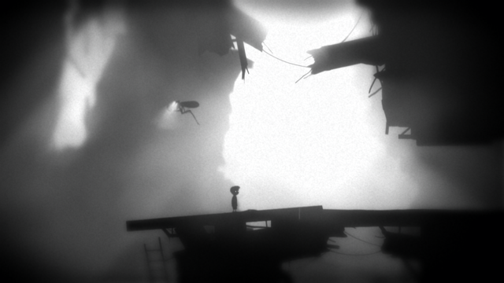

프로젝트 명 : 

목차
1. [게임명](#게임명)
2. [관련 이미지와 동영상](#관련-이미지와-동영상)
3. [대표 이미지](#대표-이미지)
4. [게임 구성요소](#게임-구성요소)
5. [게임 시스템 디자인](#게임-시스템-디자인)
6. [요구사항 (6주차)](#요구사항6주차)
7. [요구사항 (1년차)](#요구사항1년차)
8. [키보드이벤트 흐름도](#키보드이벤트-흐름도)
9. [개발 작업[(#개발-작업)

# [게임명]
## Shadow Puzzle
 

# [컨셉]
## 메인컨셉
- 그림자
- 빛으로 물체를 쏘아 그림자를 만들어 퍼즐을 풀어나감

### 서브 컨셉 1 : 
- 그래픽
- 배경은 어둡게 표현하고 플레이어는 최소한의 빛을 가지고 퍼즐을 풀러 다님.

- 플레이어는 라이터 같은 최소한의 광원을 가지고
- 각 퍼즐구간마다 랜턴을 두어 그림자를 만들게 할 생각.

### 서브 컨셉 2 : 
- 방탈출
- 플레이어는 처음에 어두운 방에서 시작하여 밖으로 탈출하기 위해
- 방을 하나하나 열면서 나아감.

플레이어는 여러방을 지나 최종적으론 밖으로 탈출하는 것이 목표.

### 서브 컨셉 3 : 
- 조작
- 캐릭터의 뒤통수를 바라보는 형태의 게임 뷰.
- 보편적인 fps의 조작법과 유사함.

### 서브 컨셉 4 : 
- 스토리

- 주인공이 스테이지를 나아가는 이유

 

# [관련 이미지와 동영상]
- 관련 이미지  

- 동영상
[youtube동영상링크](https://www.youtube.com/watch?time_continue=29&v=L1nF4XfnJMs&feature=emb_title)

 

# [대표 이미지]

 

# [컨셉과 대표이미지 기반 작품 묘사]

 

# [Shadow Puzzle 구성 요소]

 

# [게임시스템 디자인]

 

# [개발 요구사항과 흐름도]

 

# [스토리 보드]

