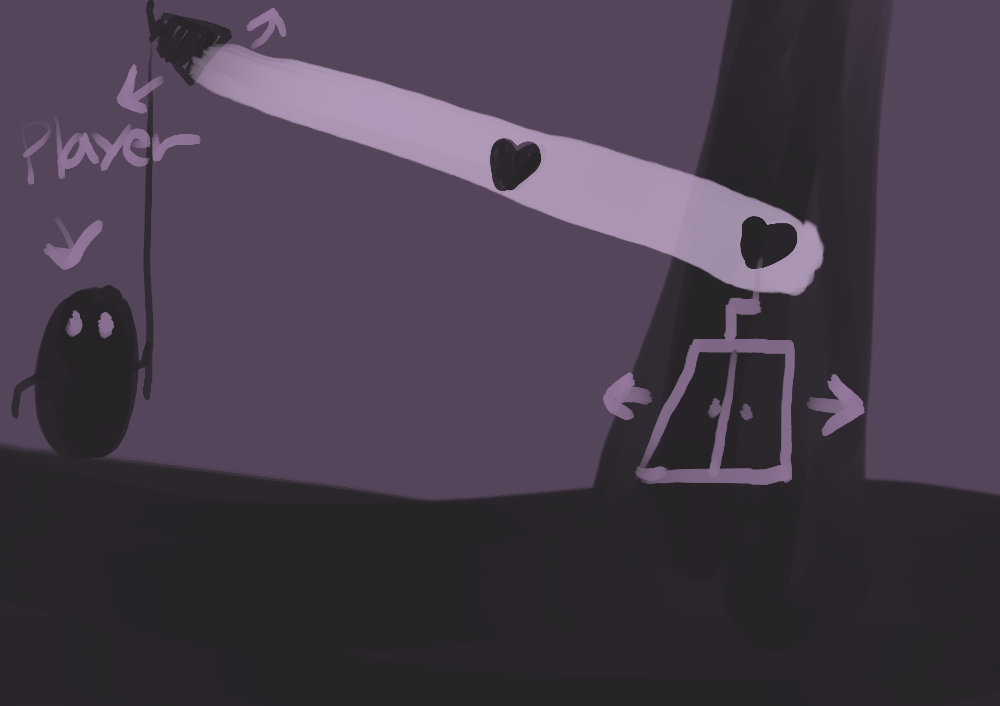

# [컨셉]
## 메인컨셉
- 빛과 그림자

빛이 있는곳엔 그림자가 있다. 빛을 이용하여 그림자를 만들고
그 그림자로 퍼즐을 풀어 나간다

### 서브 컨셉 1 : 
- 그래픽

밝으면서도 어두운 몽환적인 분위기

### 서브 컨셉 2 : 
- 탐험

스테이지를 나아가며 새로운 곳을 탐험함

### 서브 컨셉 3 : 
- 조작

앞뒤 점프 상호작용키를 사용하여 조작

### 서브 컨셉 4 : 
- 스토리

주인공이 스테이지를 나아가는 이유

  
# [관련 이미지 & 동영상]
- 관련 이미지  

- 동영상

  

- 대표 이미지

  
# [컨셉 & 대표이미지 기반 작품묘사]
> ### 대표이미지 기반 :

- 작품 묘사

> ### 컨셉 기반:

  
# [<게임제목> 구성 요소]

- 라이트 & 쉐도우

 

## 1. 메커니즘

[도전 과제]
1) 퍼즐을 풀며 방을 나아가는 것
2) 스테이지를 클리어 해야 함

[재미 요소]
1) 퍼즐을 풀어나가는 재미
2) 새로운 장소를 모험하는 재미

 

## 2. 이야기

[만들게 된 배경]  
재미있게 했던 게임을 보고 만들고 싶게 되었다

[카메라 관점]  
플레이어 기준

 

## 3. 미적요소

[디자인][컬러]  
가나다라마바사아차카타파하 가나다라마바사아차카타파하

[음향]  
가나다라마바사아차카타파하 가나다라마바사아차카타파하
	
 

## 4. 기술  
가나다라마바사아차카타파하 가나다라마바사아차카타파하
